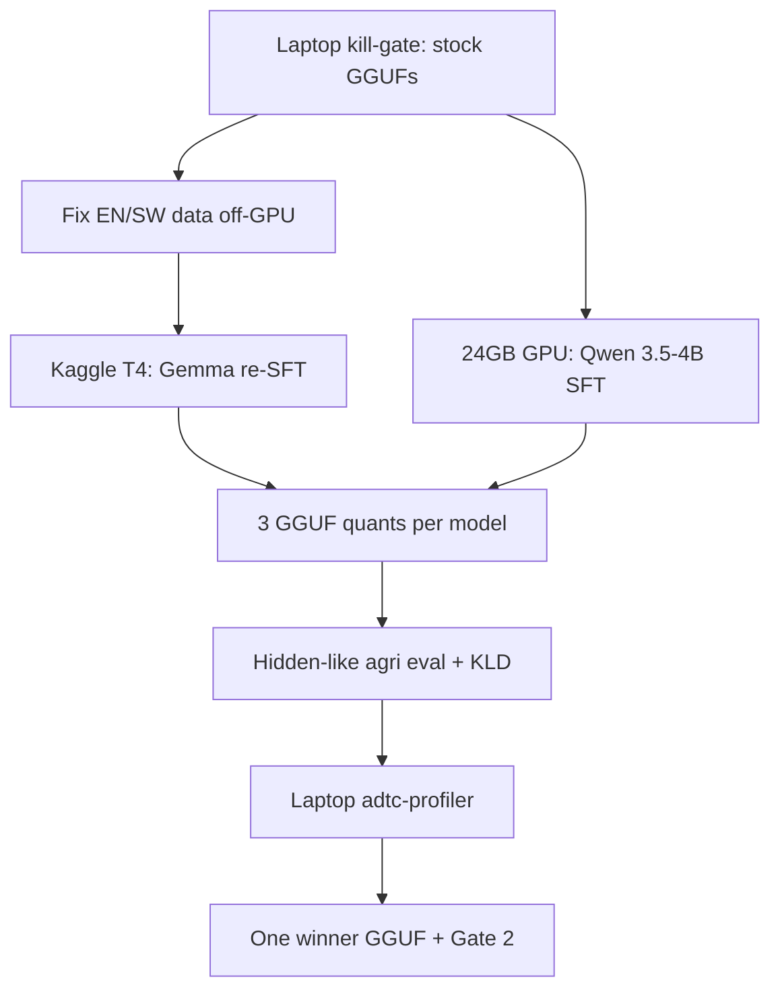

# ADTC Experiment Plan (Gemma 4 E2B + Qwen 3.5 4B)

North-star weights are the official profiler formula from the [ADTC profiler](https://github.com/Africa-Deep-Tech-Foundation/adtc-profiler): **50% accuracy, 30% throughput (capped at 15 tok/s), 20% memory vs a 7 GB RSS ceiling, minus thermal penalty**. All submitted artifacts must be a single offline `.gguf` on `llama.cpp` ([submission README](file:///home/ebrahim/Desktop/adtc-2026-submission-template/README.md)).

The current pipeline in [gemma-4-e2b/](file:///home/ebrahim/Desktop/adtc%20pipeline/gemma-4-e2b/) already does RsLoRA SFT → BF16 merge → bilingual imatrix → two GGUF candidates → GPU KLD/bench. Do **not** rebuild that. Generalize it and add a third quant plus a Qwen twin.

---

## 1. Claim audit (context vs verifiable sources)

Use these; drop the rest.

**Keep / act on**

- **Perplexity is a weak gate for compressed LLMs.** [LLM-KICK (ICLR 2024, arXiv:2310.01382)](https://arxiv.org/abs/2310.01382) shows pruning can collapse knowledge-intensive tasks at 25–30% sparsity while PPL barely moves; **quantization beats pruning**; pruned models stay usable mainly for retrieval/summarization (not closed-book agri advice). **Do not prune. Do not pick a quant by PPL/KLD alone.**
- **Domain calibration data matters.** [MixCal (arXiv:2502.18424)](https://arxiv.org/html/2502.18424v2) shows mixing in-domain + generic activations improves compressed in-domain quality without full-parameter FT. Your imatrix already uses 500 EN + 500 SW agri rows in [config.py](file:///home/ebrahim/Desktop/adtc%20pipeline/gemma-4-e2b/config.py). Add a **small generic slice** (Wiki/C4-style or `no_robots` text), not agri-only and not generic-only.
- **Naive Q4_0 on Gemma 4 QAT is the wrong “QAT-aligned” story.** [Unsloth Gemma 4 QAT](https://unsloth.ai/docs/models/gemma-4/qat) measured E2B naive Q4_0 at mean KLD **0.051** / top-1 **89.3%** vs their UD-Q4_K_XL at **0.00173** / **98.2%**, and **smaller** (2.62 GB vs 3.35 GB). Cause: llama.cpp Q4_0 uses F16 scales; the QAT lattice is BF16. Your hypothesis (“push to Q4_0 because the base is Q4_0 QAT, therefore faster”) is worth one **control** run — it is already in [model.py](file:///home/ebrahim/Desktop/adtc%20pipeline/gemma-4-e2b/model.py) as `q4_0_qat_aligned` — but **do not expect it to win**.
- **Unsloth already does the cheap QAT path you have.** Current `qat_scheme: "int4"` + BF16 load in [02_sft.py](file:///home/ebrahim/Desktop/adtc%20pipeline/gemma-4-e2b/02_sft.py) is the supported recipe. Google already QAT-trained the E2B checkpoint.
- **Qwen 3.5-4B is real and documented as fine-tuneable.** Official Qwen 3.5 repo recommends Unsloth / Swift / LLaMA-Factory. Community + Unsloth guides: prefer **16-bit LoRA**, not QLoRA; architecture is hybrid Gated DeltaNet + full attention; **thinking defaults ON in the model card**, OFF by default for small GGUFs in [Unsloth Qwen 3.5 docs](https://unsloth.ai/docs/models/qwen3.5). Q4_K_M GGUF is ~2.5–2.8 GB; Unsloth lists ~**5.5 GB** total memory for 4-bit 4B.
- **Sequence-level distillation is the only KD that fits $20.** [Kim & Rush SeqKD](https://arxiv.org/abs/1606.07947) / MiniLLM contrast: logit / on-policy KD needs a live teacher on GPU ([MiniLLM](https://arxiv.org/abs/2306.08543), [GKD](https://arxiv.org/abs/2306.13649)). You already did SeqKD offline (Llama-3.3-70B clean, GPT-OSS-120B translate). Improve the **teacher-written dataset**, do not implement MiniLLM.
- **Quality beats 25k noisy rows.** LIMA (Zhou et al., 2023) and your own REPORT already argue information density over size. The translate-script line *“If the English is agronomically wrong, still translate it”* ([kuza-en-to-sw-translate.py](file:///home/ebrahim/Desktop/adtc-2026-submission-template/scripts/kuza-en-to-sw-translate.py) L828) is a verified methodology bug: it copies English errors into Swahili.

**Drop / do not spend GPU on**

- **Inventing QAT from scratch** or **Intel Neural Compressor MXFP4 QAT**. INC 3.7 QAT targets Intel GPUs/Xeon and MXFP4, not a llama.cpp GGUF winner. Intel **AutoRound** can export `gguf:q4_k_m`, but that is PTQ you already get from `llama-quantize` + imatrix. One optional *CPU* AutoRound export is enough as a third Qwen quant if time remains — not a training project.
- **Pruning, RAG, AgriIR, AgroLLM retrieval.** [AgriIR (arXiv:2604.16353)](https://arxiv.org/html/2604.16353v1) is a 1B RAG stack. ADTC forbids network and extra runtimes at inference.
- **[MDPI Remote Sensing 17(6):974](https://www.mdpi.com/2072-4292/17/6/974)** — agricultural *burn-area segmentation*, not LLMs. Irrelevant.
- **ACM `10.1145/3819816`** — DOI did not resolve to a usable paper. Do not cite it.
- **TDS / Medium / GGUF blog posts** — useful as tutorials only. They do not justify extra methods.

**Your current submitted laptop numbers** ([REPORT.md](file:///home/ebrahim/Desktop/adtc-2026-submission-template/REPORT.md)): 5.47 tok/s, peak RSS 4.94 GB. That is `S_perf = 5.47/15 ≈ 36` and `S_eff = (7-4.94)/7 ≈ 29`. Accuracy is the only large remaining lever. A 4B model that adds 1 GB RSS and loses 1 tok/s must **win accuracy by a lot** or it loses overall.

---

## 2. Kill-gates before any paid GPU

Run these on the Ryzen 3 / 7 GB laptop with stock Unsloth GGUFs and `adtc-profiler` (no training):

| Probe | File | Abort if |
|---|---|---|
| Gemma 4 E2B QAT `UD-Q4_K_XL` | `unsloth/gemma-4-E2B-it-qat-GGUF` | OOM or thinking-on by default (force `--chat-template-kwargs '{"enable_thinking":false}'`) |
| Qwen 3.5-4B `Q4_K_M` | `unsloth/Qwen3.5-4B-GGUF` | peak RSS **> 6.2 GB** or TPS **< 3.5** vs Gemma |

If Qwen 4B fails the laptop gate, **do not SFT it**. Fallback (only then): `Qwen/Qwen3.5-2B` Q4_K_M, same 3-quant recipe. Pin a llama.cpp that actually supports Qwen 3.5 hybrid attention (current pin `aac81023` in [config.py](file:///home/ebrahim/Desktop/adtc%20pipeline/gemma-4-e2b/config.py) must be re-verified; bump only if Qwen fails to load).

Also force **thinking OFF** for all official scores. Thinking tokens inflate latency and do not help closed-book dosage/spacing factuality. Keep one local Gemma/Qwen thinking-on smoke (no GPU) for the REPORT ablation table.

---

## 3. Data work (off-GPU; this is the accuracy program)

### English (`kuzaai/agri_sft_prod_dedup_25k`)

Critiques are directionally right. Fix without exploding size:

- **Length / density:** sample 500 rows; measure instruction/response tokens vs `MAX_SEQ_LENGTH=1024`. Drop or teacher-expand rows that are too short to teach a procedure. Prefer the unused `agri_sft_prod_56k` *only* for rows that are longer and non-duplicate — not a blind 56k reload.
- **Single-turn mismatch:** the baked system prompt in [model.py](file:///home/ebrahim/Desktop/adtc%20pipeline/gemma-4-e2b/model.py) asks for one clarifying question; the SFT data never does. Add **800–1500 teacher-written 2-turn dialogs** (user → clarify → user supplies crop/location → answer). That is SeqKD, not extra GPU.
- **25k is not automatically “too small.”** Do not grow the set. Filter: reject leftover English errors instead of translating them; keep a high-density core (~15–25k).

### Swahili (rebuild a gold subset)

Change [kuza-en-to-sw-translate.py](file:///home/ebrahim/Desktop/adtc-2026-submission-template/scripts/kuza-en-to-sw-translate.py):

- Delete “translate even if English is wrong.” **Skip or repair the English first.** ( Note : I've updated the translate script , critically analyze it first before making any changes as it is updated recently )
- Shrink `GLOSSARY` to terms that appear in `QC_ENGLISH_TERMS` plus units/safety words. Locked glossary of ~132 entries over-constrains fluent Swahili.
- Strengthen QC: numeral lock, unit lock, back-translation chrF/comet on a 200-row sample, blocklist of known bad forms (already started), **max 2 retries then drop**. Target **3–8k accepted SW rows**, mixed at a higher fraction than today’s 15% if quality holds.
- Spot-check 100 rows manually. A small clean SW set beats 25k noise.

Training mix after cleanup (starting point, not dogma): all kept EN + 30–50% of gold SW (by EN count) + 5% adversarial + 5–10% general. Hold out 5% agri EN/SW for eval.

---

## 4. Models, FT, merge (limited variants)

**Only two bases** (plus 2B emergency):

| Base | Why it survives the filter | FT recipe | Merge |
|---|---|---|---|
| `unsloth/gemma-4-E2B-it-qat-q4_0-unquantized` | Already profiler-fast (4.70 tok/s in REPORT); official QAT; Unsloth + your script support it | Existing RsLoRA r=32/α=64, `qat_scheme=int4`, BF16, completion-only, 1–2 epochs on **cleaned** mix (3 epochs on dirty 25k is the old run) | Current `merge_and_unload(safe_merge=True)` → BF16 GGUF |
| `Qwen/Qwen3.5-4B` (or Unsloth twin) | Official fine-tune guidance; 201-lang coverage may help SW; ~2.6 GB Q4 | Unsloth **16-bit LoRA** r=16–32, thinking **off** in template, same completion-only SFT | Same PEFT merge. No TIES/DARE — you have one adapter |

**Do not** full-FT, DoRA, multi-adapter merges, or a third 7B. Gemma KV-sharing guard (layers 15–34) stays.

Hard-coded system prompt stays injected in the chat template (already implemented). That is a scored “other method,” not an extra experiment.

---

## 5. Three GGUF quants per model

All use **MixCal-style imatrix**: 400 agri EN + 400 agri SW + 200 generic. Then `llama-quantize`. Screen with existing [06_screen.py](file:///home/ebrahim/Desktop/adtc%20pipeline/gemma-4-e2b/06_screen.py) **plus** the hidden-like agri set (not KLD winner-take-all).

**Gemma (QAT base)**

1. `q4_k_m_control` — current recipe (Q4_K_M bulk, Q6_K attn, Q8_0 emb). Submitted v1 analog.
2. `q4_0_qat_aligned` — already in script (`--pure` Q4_0). The user’s cheap one-variable test. Expected worse per Unsloth.
3. `q4_k_m_ud_style` — Q4_K_M + imatrix, **no Q6_K attention override** (Unsloth: extra precision vs the QAT lattice can *hurt* and inflate size). This is the speed/RSS candidate.

**Qwen (non-QAT)**

1. `q4_k_m_imatrix` — community default.
2. `q4_k_xl_mixed` — Unsloth Dynamic / higher-precision sensitive tensors (or `save_pretrained_gguf` UD-Q4_K_XL if the trained merge supports it).
3. `iq4_xs` or `q4_k_s` — smaller/faster for the 7 GB laptop (`S_eff` / `S_perf`).

If a third Qwen export is still needed and GPU is gone, Intel AutoRound `gguf:q4_k_m` on **CPU** is the only INC-family experiment that can still produce a legal GGUF.

---

## 6. Evaluation (Stage 1 report + Gate 2)

Organizers add **2 hidden domain prompts** to your 2 `metadata.json` prompts ([README](file:///home/ebrahim/Desktop/adtc-2026-submission-template/README.md)). The report does not contain those hidden items. Build a **proxy hidden set** before spending GPU:

- Seed from Gate 2: calf-care EN, banana spacing SW.
- LLM-generate ~30 more: pests, soil, livestock, safety/dosage refusal, East African crops, Swahili orthographic variants. Hold them out of training.
- Rubric (you score first, then optional LLM-as-judge): language match, actionable steps, no invented exact dose, asks one clarify when needed, East-Africa-plausible numbers.
- GPU screen: KLD vs BF16 + `llama-bench` (already in `06_screen.py`) — use as **quant fidelity**, not accuracy.
- Laptop: `adtc-profiler run --mode participant` on the 2–3 finalists for TPS / RSS / thermal. Fill REPORT benchmarks from this, not from T4.

Gate 2 gaps already called out in REPORT: missing adapter + trainer logs, empty base column in `before_after.json`, missing notebook link. The Kaggle Gemma re-SFT **closes provenance** as well as refreshing weights.

---

## 7. Compute budget (Kaggle T4 free + $20 on 24 GB)

Assume ~$0.30–0.40/hr (4090/L4) → **~50–65 GPU-hours**. Spend far less.

| Job | Where | Hours | $ |
|---|---|---|---|
| Laptop kill-gate + hidden-set scoring | Local CPU | — | 0 |
| Data filter, SW gold, multi-turn SeqKD | API / local | — | 0 GPU |
| Gemma cleaned SFT + merge + imatrix + 3 quants | Kaggle T4, modular stages (12h cap) | 8–14 wall | 0 |
| Qwen 4B SFT (1–2 epochs) + merge | Paid 24 GB | 4–8 | ~$2–4 |
| Qwen imatrix + 3 quants + KLD | Paid 24 GB or leftover Kaggle | 1–3 | ~$1 |
| One retry / one epoch-ablation | Paid | ≤4 | ~$1–2 |
| **Reserve** | — | — | **~$12 unused** |

Do **not** use the reserve for QAT-from-scratch, MiniLLM, or a third base model.

---

## 8. What goes in the submitted model writeup

Map 1:1 to the new guideline:

1. **Datasets** — cleaned EN core + gold SW subset + multi-turn clarify slice + adversarial; sizes and QC fail rates.
2. **Base** — Gemma 4 E2B QAT vs Qwen 3.5-4B, with laptop kill-gate numbers and technical-report citations.
3. **Fine-tuning** — Unsloth RsLoRA/LoRA, completion-only, thinking off, 1–2 epochs on cleaned mix.
4. **Merging** — single PEFT `merge_and_unload` into BF16.
5. **Quantization** — MixCal imatrix + the 3-variant table + winner recipe.
6. **Other** — SeqKD only (no logit KD); thinking **off**; hardcoded Kuza system prompt.

---

## 9. Code changes (after plan approval)

- Keep [gemma-4-e2b/](file:///home/ebrahim/Desktop/adtc%20pipeline/gemma-4-e2b/) as the Gemma driver; add `qwen-3.5-4b/` by cloning `model.py` + `config.py` (chat template, no KV-share guard, Qwen LoRA targets).
- Add the third `QUANT_CANDIDATES` entry and MixCal generic rows in [04_imatrix.py](file:///home/ebrahim/Desktop/adtc%20pipeline/gemma-4-e2b/04_imatrix.py).
- Add `eval_hidden.py`: run the proxy hidden set through `llama-cli --jinja --single-turn --temp 0`, write a score JSON for REPORT.
- Tighten the translate script QC; do not retranslate all 25k.
- Winner path: one GGUF → `download_model.sh` + REPORT + provenance from the Kaggle/paid run.