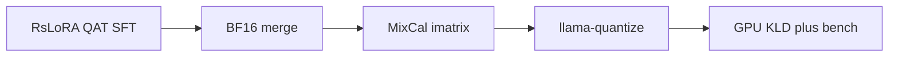

# Gemma 4 E2B pipeline: critique and change plan

The pipeline is a correct **QAT-aware PEFT → BF16 merge → imatrix PTQ → GGUF screen** stack for Kuza. It will not win on accuracy, memory, or tok/s by adding more training tricks. The losses come from **fighting Gemma 4’s QAT lattice**, **training on left-truncated chats**, and **optimizing the wrong metrics**.

Deployment memory here is **weights + PLE tables**, not KV. E2B is 2.3B effective / 5.1B with embeddings ([Gemma 4 tech report](https://arxiv.org/html/2607.02770)): ~1.87B compute, ~2.34B PLE, plus frozen 150M vision and 305M audio. At `ctx=1024` with 20/35 KV sharing and 512-token sliding window, KV is a small fraction of RSS/VRAM. Shrinking PLE/embeddings and dropping unused encoders moves the memory needle; `-ctk q4_0` does not.

---

## What is already scientifically sound — keep

- **QAT base + Unsloth `qat_scheme=int4`.** Jacob et al. 2018 (QAT) plus Google’s Gemma 4 QAT checkpoints. Fake-quant during LoRA keeps adapters in the 4-bit forward. Do not invent a second QAT trainer.
- **RsLoRA r=32, α=64.** Kalajdzievski 2023 ([arXiv:2312.03732](https://arxiv.org/abs/2312.03732)): scale by `α/√r`, not `α/r`. Rank 32 is in the regime where this matters. Do not switch to DoRA.
- **KV-sharing LoRA guard (layers 15–34).** Matches E2B `num_kv_shared_layers=20`. Training those K/V projections would be training tensors the checkpoint does not own.
- **Completion-only SFT** via `train_on_responses_only`.
- **MixCal-style imatrix** (400 EN + 400 SW agri + 200 generic). Supported by MixCal ([arXiv:2502.18424](https://arxiv.org/abs/2502.18424)) and by llama.cpp imatrix (Kawrakow / [PR #4861](https://github.com/ggerganov/llama.cpp/pull/4861)): column-wise `E[a²]` is a diagonal Hessian proxy, same idea as GPTQ/AWQ at much lower cost.
- **BF16 merge gates, pinned llama.cpp, provenance.** Necessary for Gate 2; not an accuracy lever.

---

## Failure modes ranked by impact on the three objectives

### 1. Over-precise GGUF overrides fight the QAT lattice (accuracy + memory + tok/s)

[`model.py` `quant_command`](gemma-4-e2b/model.py) forces:

- `token_embd` / `output` → **Q8_0**
- `per_layer_token_embd` → **Q6_K** (~2.34B params)
- `per_layer_model_proj` → **BF16**
- attention → **Q6_K** on two of three candidates

Unsloth’s Gemma 4 QAT measurements (the relevant empirical paper for this exact checkpoint):

| E2B method | Disk | Mean KLD | Top-1 |
|---|---|---|---|
| UD-Q4_K_XL | **2.62 GB** | **0.00173** | **98.2%** |
| naive llama.cpp Q4_0 | 3.35 GB | 0.051 | 89.3% |

Cause: llama.cpp Q4_0 uses **F16 scales**; Gemma QAT uses **BF16 scales**. Higher bit-width than the lattice does **not** recover the QAT codebook; it can increase KLD and file size. Unsloth: *“precisions higher than UD-Q4_K_XL degrade accuracy rather than improve it”* and *“Q6_K wasn’t needed for embeddings.”*

So `q4_0_qat_aligned` (`--pure` Q4_0) is a **control, not a winner**. `q4_k_m_control` (Q6_K attention) is the submitted-v1 analog and likely **larger and no more accurate** than `q4_k_m_ud_style`.

PLE math: vocab 262k × ~305-d × 35 layers ≈ 2.34B. Q6_K on that table is the largest self-inflicted memory tax in the repo. Decode on a bandwidth-bound laptop/GPU is weight-load bound (Dao et al. FlashAttention; standard LLM decode analysis): **smaller GGUF → higher tok/s**.

**Change:** Make `q4_k_m_ud_style` the default production recipe (no attention Q6_K). Drop Q8_0 embedding / Q6_K PLE / BF16 proj overrides unless an ablation shows hidden-set gain **and** memory still fits. Add a fourth candidate that actually matches Unsloth Dynamic (`UD-Q4_K_XL` via `save_pretrained_gguf` after merge, or a tensor map copied from Unsloth). Optional memory candidate: official **mobile mixture / UD-Q2_K_XL** (2.19 GB, mean KLD 0.004, top-1 97.8%) — only if hidden agri score stays within noise of Q4.

### 2. Keep-end truncation trains the model on the wrong tokens (accuracy)

[`prepare_sft_data`](gemma-4-e2b/common.py) does `full_ids[-MAX_SEQ_LENGTH:]` (keep the tail). TRL now **deprecates `keep_end`** in favor of `keep_start`. For chat SFT this is worse than a style issue: the tail is often the assistant answer, so the model can lose the system prompt and user turn while still passing the `RESPONSE_PART` subsequence check.

[`render_corpus`](gemma-4-e2b/common.py) does the opposite (`ids[:max_seq_length]`). Training and imatrix/eval see **different truncation distributions**, so KLD is not even measuring the trained policy.

**Change:** Drop or right-truncate rows that exceed 1024 **after** the response marker is present; never left-slice. Align imatrix/eval rendering. Keep `MAX_TRUNCATED_FRACTION=0.10` as a data-quality tripwire (if it fires, shorten the system prompt or split long multiturn rows — do not silently crop).

### 3. Thinking is off in hidden eval, on in the training template (accuracy + tok/s)

Gemma 4 is a hybrid-thinking model ([tech report](https://arxiv.org/html/2607.02770)). Qwen’s [`model.py`](qwen-3.5-4b/model.py) injects `enable_thinking=false`. Gemma’s does **not**. [`experiments/eval_hidden.py`](experiments/eval_hidden.py) already passes `--chat-template-kwargs '{"enable_thinking":false}'`, but SFT rendering and [`smoke_load`](gemma-4-e2b/common.py) do not.

Thinking traces burn generation tokens and inflate latency; they do not help closed-book dosage/spacing. Leviathan et al. 2023 / decode-cost: extra tokens are linear in wall-clock.

**Change:** Mirror the Qwen template patch in Gemma `patch_chat_template` / `render_*`. Pass thinking-off into `llama-cli` in screen and smoke.

### 4. Screening optimizes KLD on GPU, then does not pick a winner (all three objectives)

[LLM-KICK (ICLR 2024, arXiv:2310.01382)](https://arxiv.org/abs/2310.01382): compression can collapse knowledge-intensive tasks while PPL/KLD barely moves. Agri advice is closed-book factual, exactly that regime.

[`06_screen.py`](gemma-4-e2b/06_screen.py) records mean KLD + GPU `llama-bench` and writes *“No winner selected here.”* [`run.sh`](gemma-4-e2b/run.sh) never calls `eval_hidden.py`. GPU TPS with `-ngl 999` is not the ADTC laptop score (50% accuracy, 30% throughput capped at 15 tok/s, 20% memory vs 7 GB RSS).

**Change:** After quants, run `eval_hidden.py` on each GGUF. Rank by hidden mean, then size, then TPS. Keep KLD as a **fidelity diagnostic**, not the objective. Document that CUDA bench is not the submission number.

### 5. Multimodal weights and unused MTP are left on the table (memory + tok/s)

Merge loads `Gemma4ForConditionalGeneration`. E2B carries **150M vision + 305M audio** frozen encoders and a **76M MTP drafter** (tech report Table 1). Google: text-only without PLE is &lt;1 GB; you should **not** drop PLE (that is the 2.3B vs 5.1B gap), but you **should** drop vision/audio for a text agri assistant.

MTP + speculative decoding (Leviathan et al. 2023; Li et al. 2024) is the only in-GGUF throughput method the architecture already ships. Verify whether the pinned llama.cpp commit (`aac81023`) loads the Gemma 4 drafter; if yes, screen with speculative decoding on. Do not add a second draft model (ADTC is one GGUF).

**Change:** Convert text-only (no mmproj / no audio encoder). Keep PLE. Probe MTP; enable if it improves tok/s without raising RSS past the 7 GB-style ceiling.

### 6. Imatrix under-uses the MixCal corpus (accuracy of PTQ)

[`04_imatrix.py`](gemma-4-e2b/04_imatrix.py) builds ~1000 rendered rows then passes `--chunks 200`. Only the first 200 chunks of 1024 tokens update the Hessian proxy. MixCal’s point is **coverage**, not a short prefix.

**Change:** Set `--chunks` to cover the full calibration file (or slightly above). Keep the EN/SW/generic mix; do not switch to WikiText-only.

---

## Training knobs: change little

| Knob | Verdict |
|---|---|
| RsLoRA r=32, QAT int4, no DoRA | Keep |
| `constant_with_warmup`, 2 epochs, early stop on eval_loss | Keep for now; eval_loss is a weak agri metric — hidden set is the real early-stop proxy **after** a run, not during |
| NEFTune α=5 | Keep (Jain et al., ICLR 2024). Gains are smaller under quantized/LoRA FT than full FT; not worth a sweep |
| `packing=False` | Leave false until truncation is fixed. Packing + completion-only masking is easy to get wrong; it speeds **training**, not deploy tok/s |
| LoRA on PLE tables | Skip in v1. PLE is a lookup; Unsloth already excludes vision. Domain vocab can wait for an ablation |
| Full-FT / MiniLLM / pruning / RAG | Do not. SeqKD belongs in the **dataset**, not a live teacher (Kim & Rush 2016 vs MiniLLM GPU cost) |

Data quality still dominates SFT (LIMA, Zhou et al. 2023). That work lives in `data/`, not this folder: do not grow 25k; do not translate agronomically wrong English.

---

## Runtime defaults for memory and tok/s

At `ctx=1024`, quantized KV is a small save. V-cache quant **requires** flash attention. Screen currently uses `-ctk q4_0 -ctv q8_0 -fa on`.

**Change:** Default deploy/screen to **`-fa on`, `-ctk q8_0 -ctv q8_0`** (or F16 K/V if memory allows). Ablate q4_0 K only if hidden score is flat **and** RSS is the binding constraint. Do not treat GPU `llama-bench` as the throughput score.

Gemma 4 recommended sampling is temp 1.0 / top_p 0.95 / top_k 64. Keep **temp 0** for KLD/smoke determinism; use recommended sampling on the hidden rubric if greedy under-scores language/style.

---

## Implementation order (after approval)

1. **Truncation + thinking-off** in [`common.py`](gemma-4-e2b/common.py) and [`model.py`](gemma-4-e2b/model.py). Highest accuracy ROI, no extra GPU.
2. **Quant recipe:** demote Q6_K/Q8_0/BF16 overrides; keep `q4_k_m_ud_style`; add `ud_q4_k_xl`; keep `q4_0_qat_aligned` as control only.
3. **Text-only GGUF** in [`03_reference.py`](gemma-4-e2b/03_reference.py) (strip vision/audio).
4. **Imatrix chunks** in [`04_imatrix.py`](gemma-4-e2b/04_imatrix.py).
5. **Close the eval loop:** [`06_screen.py`](gemma-4-e2b/06_screen.py) + [`run.sh`](gemma-4-e2b/run.sh) call hidden scoring; rank by hidden / size / TPS; KLD is a log field.
6. **MTP probe** on pinned llama.cpp; enable speculative decoding in screen if it works.

Do not touch LoRA rank, QAT scheme, KV-sharing guards, MixCal language mix, or BF16 merge safety checks unless a later ablation demands it.
