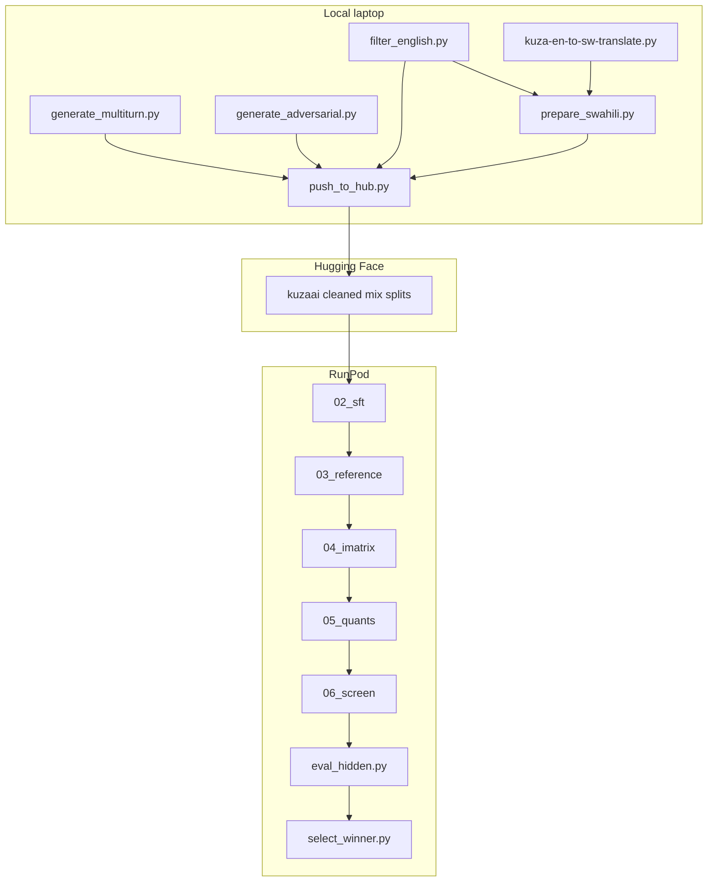

# Pipeline cleanup, HF data, and RunPod docs

This is a cleanup and documentation pass, plus a small set of pipeline fixes that currently make training silently wrong or messy on a cloud GPU.

## What is true today

There is **no root README**. Flow is scattered across `data/run_data.sh`, two `00–07` pipelines, Kaggle/kill-gate wrappers, and an old Cursor plan.

Training does **not** read `mix_*.jsonl`. Both pipelines load `data/final/{english,swahili,adversarial,multiturn}.jsonl` via [`load_training_rows`](gemma-4-e2b/common.py) (identical copy in [`qwen-3.5-4b/common.py`](qwen-3.5-4b/common.py)). Swahili Hub fallback is **off**, and `data/final/swahili.jsonl` is missing, so the hardcoded `MIX["swahili_of_english"] = 0.35` is silently skipped. Current mix is English + 104 multiturn + ~5% adversarial + Hub `HuggingFaceH4/no_robots`.



---

## 1. Delete base-model profiling and leftover data

**Delete (profiling / laptop / retired):**
- [`experiments/laptop_killgate.py`](experiments/laptop_killgate.py) — stock GGUF CPU RSS/TPS gate
- Kill-gate block in [`experiments/paid_qwen.sh`](experiments/paid_qwen.sh) (script becomes a thin `qwen-3.5-4b/run.sh` wrapper, or is folded into the README and removed)
- [`experiments/kaggle_gemma.sh`](experiments/kaggle_gemma.sh) — Kaggle-only paths
- Kill-gate fields and laptop-path notes in [`experiments/select_winner.py`](experiments/select_winner.py)
- [`data/filter_swahili_gold.py`](data/filter_swahili_gold.py) — retired stub that points at `incoming/`

**Delete (unused / bulky / not for the pod):**
- `data/incoming/` and every `incoming` string
- `data/quarantine/` (stale 8k Hub Swahili)
- `data/final/mix_*.jsonl` (byte copies; SFT never reads them)
- `data/final/swahili_prepare_report.json` incoming path
- After you push to HF: bulky `data/final/english.jsonl` (~59 MB) and the other generated JSONL from the **repo you upload to the pod**. Prep scripts stay. Add a `.gitignore` for `data/final/*.jsonl`, `data/.hf-cache/`, translator `*.progress.jsonl` / `*.failed.jsonl` so they are not copied again.

`06_screen.py` stays — that is **post-SFT quant screening**, not base-model profiling.

---

## 2. Data prep: no `incoming`, Swahili is a first-class file, then HF

**Translate the filtered English set, not the raw Hub file.** Today [`kuza-en-to-sw-translate.py`](data/kuza-en-to-sw-translate.py) reads `kuzaai/agri_sft_prod_dedup_25k` / `gemma4_agri_sft_25k.jsonl` and IDs fallback to `english-{index}`, while [`filter_english.py`](data/filter_english.py) uses `id` or `en-{index}` and drops rows. That breaks parent QC in [`prepare_swahili.py`](data/prepare_swahili.py).

Changes:
- Translator default input: [`data/final/english.jsonl`](data/final/english.jsonl) (already filtered, hidden-held-out). Keep Hub as `--source-hub` override only.
- `to_record()` writes `english_source_id` (= parent `source_id`) so numeral/length QC actually runs.
- Align fallback IDs to `en-{index}` (same as `filter_english.py`).
- Default output: `data/final/swahili_raw.jsonl` (not cwd / Kaggle).

[`prepare_swahili.py`](data/prepare_swahili.py):
- Default `--input` = `data/final/swahili_raw.jsonl` (no `incoming`).
- If missing: exit non-zero with a short hint (do not delete a good `swahili.jsonl` and write a “not attached” report).
- Remove the duplicate `pid in heldout` branch (lines 135–141).
- Output stays `data/final/swahili.jsonl`.

[`prepare_cleaned_mix.py`](data/prepare_cleaned_mix.py): stop writing `mix_*`. Write only `manifest.json` (counts + recommended mix). Drop the incoming note.

New [`data/push_to_hub.py`](data/push_to_hub.py):
- Uploads splits from `data/final/`: `english`, `swahili` (if present), `adversarial`, `multiturn`, and a small **general** slice (same filters as SFT: 200/250 word caps, ~8% of English count) so the pod does not pull `HuggingFaceH4/no_robots`.
- Default repo: `kuzaai/kuza_sft_cleaned` (override `--repo` / `KUZA_MIX_DATASET`).
- You create the HF repo once, then replace outdated `kuzaai/agri_sft_25k_swahili` by pointing Swahili at this new split (or a dedicated Swahili repo ID you add later).

[`data/run_data.sh`](data/run_data.sh) becomes:

```bash
python data/generate_multiturn.py
python data/generate_adversarial.py
python data/filter_english.py
# then, when you have GROQ_API_KEY:
# python data/kuza-en-to-sw-translate.py
# python data/prepare_swahili.py
python data/prepare_cleaned_mix.py   # manifest only
python data/push_to_hub.py --repo kuzaai/kuza_sft_cleaned
```

Both [`gemma-4-e2b/model.py`](gemma-4-e2b/model.py) and [`qwen-3.5-4b/model.py`](qwen-3.5-4b/model.py) `DATASETS` become env-overridable, defaulting to the new repo (plus optional per-split overrides). **Remove** `kuzaai/agri_sft_25k_swahili`. Swahili Hub fallback turns **on** once `KUZA_SW_DATASET` / the mix repo is set. If mix asks for Swahili and the split is empty, **fail** — do not train English-only while advertising a bilingual system prompt.

---

## 3. Critique of Gemma / Qwen assumptions (what we will change vs keep)

**Change (bugs or silent failures):**
- **Swahili 35% vs zero rows.** Hardcoded `MIX` disagrees with `manifest.json` (`0.0`). After HF attach, keep `0.35` and fail if the split is missing.
- **Head-chop at 1024 tokens** in `prepare_sft_data` can drop the `<|turn>model` / `<|im_start|>assistant` marker, then discard the row. Switch to **keep the tail** (response + as much prefix as fits) so multiturn rows are not silently dropped.
- **Qwen `apply_chat_template` swallows Unsloth failures** ([`qwen-3.5-4b/model.py`](qwen-3.5-4b/model.py) lines 210–216). Make it fail loud like Gemma, or completion-only labels can train on the wrong spans.
- **Qwen `02_sft.py` docstring** still says “QAT-aware”; `qat_scheme` is `None`. Fix the comment.
- **`run.sh` has no preflight.** Add checks: `HF_TOKEN`, a visible GPU, and that the HF mix repo (or `KUZA_LOCAL_DATA`) is reachable.
- **`select_winner.py` looks in the wrong place** (`experiments/results/screen_*.json`) while `06_screen.py` writes `$KUZA_WORK_DIR/.../screen/results.json`. Point it at screen + hidden JSON. Drop kill-gate.

**Keep (intentional model differences):**
- Gemma QAT int4 + r=32 + LR `2e-5` vs Qwen no-QAT + r=16 + LR `2e-4` — different bases; do not force the same LR.
- Gemma KV-share LoRA exclusion (layers 15–34) — correct for E2B; Qwen stub is fine.
- Quant recipes (Gemma QAT-aligned `q4_0` vs Qwen `iq4_xs`) — keep.

**Document only (no code change unless you ask later):**
- `MAX_SEQ_LENGTH = 1024` + `packing: False` is tight for 4+ turn dialogs; 2048 would keep more multiturn.
- Pinned wheels in `config.py` (`unsloth==2026.8.19`, `torch==2.10.0`) must exist on the pod’s CUDA index or `00_install_deps.py` dies.
- llama.cpp is built from source every fresh pod (`01_setup_llama_cpp.py`); needs cmake + CUDA. `detect_cuda_arch()` default `"80"` is wrong on some cards — set `CUDA_ARCH` on the pod.
- Single-GPU `device_map={"": 0}` — extra GPUs are unused.

---

## 4. Slim `experiments/` (post-train only)

Keep and de-laptop:
- [`experiments/eval_hidden.py`](experiments/eval_hidden.py) — `LLAMA_CLI` from `--llama-cli` / `KUZA_LLAMA_CLI` / `$KUZA_WORK_DIR/tools/.../llama-cli`. Default `-ngl 99` on GPU (not hardcoded `0` + `/home/ebrahim/src/llama.cpp`).
- [`experiments/select_winner.py`](experiments/select_winner.py) — rank `hidden_*.json` + screen results; write `experiments/results/winner.json`. Remove `/home/ebrahim/Desktop/adtc-2026-submission-template/` paths and kill-gate.

Delete the rest of the folder’s launch/profiling scripts as in section 1. `07_provenance.py` can still copy into `experiments/provenance/`.

---

## 5. Documentation (root `README.md`)

One file, in this order:

1. **Local data prep** — exact commands to build the final SFT mix and push to HF (including Groq translate → `prepare_swahili.py` → you paste the Swahili repo/split ID into `model.py` or `KUZA_SW_DATASET`).
2. **What `experiments/` is** — hidden-set rubric + winner pick after GPU screen; not part of training.
3. **Run on RunPod** — env vars, Gemma vs Qwen snippets:

```bash
export HF_TOKEN=hf_...
export KUZA_WORK_DIR=/workspace/kuza-pipeline
export KUZA_MIX_DATASET=kuzaai/kuza_sft_cleaned   # after you push
# optional until Swahili exists:
# export KUZA_SW_DATASET=kuzaai/your_swahili_repo

cd gemma-4-e2b && bash run.sh
# or
cd qwen-3.5-4b && bash run.sh
```

4. **After training** — `eval_hidden.py` / `select_winner.py` snippets using the pipeline-built `llama-cli`.
5. **What not to upload to the pod** — `incoming`, `quarantine`, `mix_*`, cleaned JSONL, kill-gate, translator checkpoints.

No other new markdown.

---

## Out of scope

- Re-profiling base models
- Changing Gemma/Qwen LR, LoRA rank, or quant recipes
- Deduplicating the two identical `common.py` copies
- Running translation or SFT in this pass
