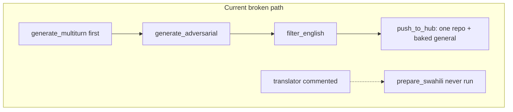
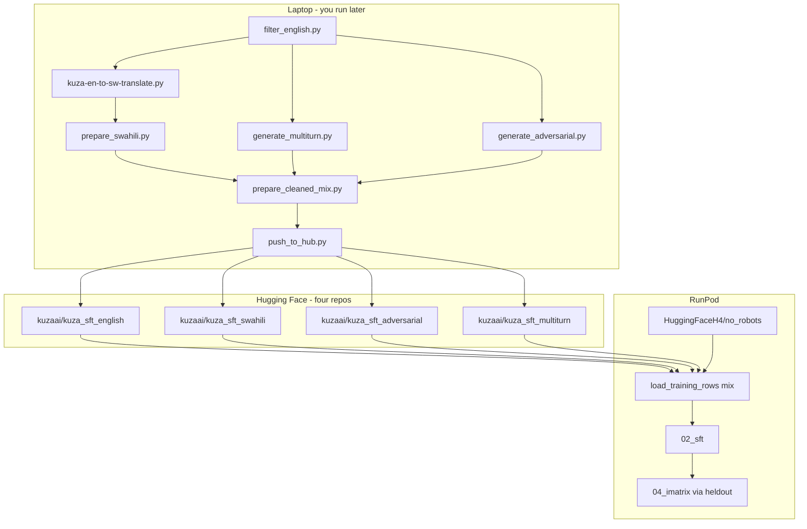

# Separate Hugging Face datasets, GPU-side mix

Decisions locked in: keep the existing hand-authored multi-turn and adversarial sets; upload **four separate Hub datasets**; mix on GPU at train time; fetch `HuggingFaceH4/no_robots` on the pod (do not upload a general slice). Do **not** run filter/translate/push in this pass — only prepare the scripts and a runbook.

---

## Critique of what exists today

The leftover-cleanup pass already happened (`incoming/`, `quarantine/`, `mix_*.jsonl` are gone). The remaining problem is that the **data contract does not match the intended six-step flow**.



| Intended step | Current reality | Severity |
|---|---|---|
| 1. Filter English locally | [`filter_english.py`](data/filter_english.py) works (25,311 kept, 2 hidden-held-out). [`run_data.sh`](data/run_data.sh) runs it **third**, after synthetic generation. Env `KUZA_EN_DATASET` is also the **training** cleaned-repo var — name collision. | Medium |
| 2. Translate cleaned English | [`kuza-en-to-sw-translate.py`](data/kuza-en-to-sw-translate.py) already defaults to `data/final/english.jsonl` → `swahili_raw.jsonl`, but the final write **strips all metadata** to bare `[{role, content}, …]` arrays (lines 3110–3116). Checkpoint has `source_id` / `english_source_id`; the file `prepare_swahili.py` reads does not. | **Blocker** |
| 3. Clean generated Swahili | [`prepare_swahili.py`](data/prepare_swahili.py) never succeeded (`swahili_attached: false`). Even after translation it would mark every row `no_messages` because [`schema.extract_messages`](data/schema.py) only accepts dicts. Output also drops `english_source_id`. | **Blocker** |
| 4. Multi-turn from steps 1–3 | [`generate_multiturn.py`](data/generate_multiturn.py) is 104 hand-authored 4-turn dialogs (66 EN + 38 SW). **Keep as-is** (your choice). It does not read cleaned EN/SW, so it can run any time. | Align (keep) |
| 5. Adversarial examples | [`generate_adversarial.py`](data/generate_adversarial.py) is 130 hand-authored refusal pairs (65 EN + 65 SW). **Keep as-is.** | Align (keep) |
| 6. Separate Hub datasets, mix on GPU | [`push_to_hub.py`](data/push_to_hub.py) uploads **one** repo `kuzaai/kuza_sft_cleaned` with named splits and an inline `no_robots` slice. Both [`model.py`](gemma-4-e2b/model.py) files default every `DATASETS[key]` to that same repo. Mix-on-GPU already exists in [`common.py`](gemma-4-e2b/common.py). | Must change |

Other issues to fix while we are here:

- Translator QC uses the **first** user/assistant pair; English filter uses the **last**. After filtering, rows are almost all 2-turn, so this only matters if `--source-hub` is used on raw Hub data. Keep `--source-hub` as override only.
- `push_to_hub.py` **warns** and continues without Swahili; SFT **fails** if `swahili_of_english=0.35` and the split is empty. Same mismatch for `general` (silent empty).
- `load_hub_rows` tries `split=key` first (`english`, `swahili`, …). Dedicated single-purpose repos will have `train`. Fallback to `first_split` works but is noisy and wrong if a repo ever has extra splits.
- Imatrix calibration already samples from SFT `heldout.jsonl` (EN eval + SW eval + 250 general). Separate Hub datasets make that heldout a **view** of the same four sources plus `no_robots` — which is the reason you preferred this over a pre-shuffled mix. No new calib loader in this pass; keep writing heldout from the GPU mix.

---

## Target flow (scripts prepared now; you run later)



Default mix stays: **100% English train + 35% Swahili + 8% no_robots + 5% adversarial + all multi-turn**.

Default Hub IDs (override with env):

- `KUZA_EN_DATASET=kuzaai/kuza_sft_english`
- `KUZA_SW_DATASET=kuzaai/kuza_sft_swahili`
- `KUZA_ADV_DATASET=kuzaai/kuza_sft_adversarial`
- `KUZA_MT_DATASET=kuzaai/kuza_sft_multiturn`
- `KUZA_GENERAL_DATASET=HuggingFaceH4/no_robots`

Raw English source for the filter (different var, to end the collision): `KUZA_EN_SOURCE=kuzaai/agri_sft_prod_dedup_25k`.

---

## Script changes (this implementation pass)

### 1. English filter — [`data/filter_english.py`](data/filter_english.py)

Already the right script. Small contract fixes only:

- Read raw Hub from `KUZA_EN_SOURCE` (not `KUZA_EN_DATASET`).
- Add `--source` / `--output` argparse so a local JSONL can be filtered without Hub.
- Fix `load_rows()` return annotation (`tuple`, not `list[dict]`).

No filter-rule changes. Existing `english.jsonl` (25,311) can be reused; re-run only if you want a fresh pass.

### 2. Translator final format — [`data/kuza-en-to-sw-translate.py`](data/kuza-en-to-sw-translate.py)

This is the one blocker that makes step 3 impossible.

- `to_record()` should emit a full [`standard_record`](data/schema.py) (`language=swahili`, `source=swahili`, `source_id`, `instruction`, `response`) plus `english_source_id`.
- Final `write_jsonl` writes those dicts, not `rec["messages"]`.
- Coverage validation checks `messages` + `source_id` on dicts (delete the “bare arrays, exactly as requested” note — that format was a workaround for a TypeError).
- Keep default input `data/final/english.jsonl`, default output `data/final/swahili_raw.jsonl`, resume via `.progress.jsonl`.

### 3. Swahili QC — [`data/prepare_swahili.py`](data/prepare_swahili.py) and [`data/schema.py`](data/schema.py)

- `schema.extract_messages`: if the JSONL line is a bare list of turns, wrap it so an old `swahili_raw.jsonl` still parses.
- Propagate `english_source_id` onto kept records.
- If the input file exists but **zero** rows are kept, exit non-zero (do not silently delete a good `swahili.jsonl` and continue).
- Keep parent/held-out/numeral/length QC as-is.

### 4. Multi-turn and adversarial — no generator rewrite

[`generate_multiturn.py`](data/generate_multiturn.py) and [`generate_adversarial.py`](data/generate_adversarial.py) stay hand-authored. Only orchestration order changes.

Practical note for the runbook: they do **not** read EN/SW files, so they can run in parallel with Groq translation to save time.

### 5. Manifest — [`data/prepare_cleaned_mix.py`](data/prepare_cleaned_mix.py)

- Require Swahili (fail if `swahili.jsonl` missing/empty) once you are past translation; add `--allow-empty-swahili` only for English-only dry runs.
- Replace single `hub_repo` with `hub_repos`: `{english, swahili, adversarial, multiturn}` plus `general_source: HuggingFaceH4/no_robots`.
- Keep writing counts + recommended mix; still do not write `mix_*.jsonl`.

### 6. Push four repos — [`data/push_to_hub.py`](data/push_to_hub.py)

Rewrite to push each local JSONL as its **own** dataset (`train` split):

```bash
python data/push_to_hub.py \
  --english-repo kuzaai/kuza_sft_english \
  --swahili-repo kuzaai/kuza_sft_swahili \
  --adversarial-repo kuzaai/kuza_sft_adversarial \
  --multiturn-repo kuzaai/kuza_sft_multiturn
```

- Drop `general_slice()` / `--skip-general` / `HuggingFaceH4/no_robots` from this script.
- Fail if any of the four local files is missing (including Swahili).
- `--private` still applies to all four.
- You create the four Hub repos once before the first push.

### 7. Orchestration — [`data/run_data.sh`](data/run_data.sh)

```bash
python data/filter_english.py
# GROQ_API_KEY:
# python data/kuza-en-to-sw-translate.py
# python data/prepare_swahili.py
python data/generate_multiturn.py
python data/generate_adversarial.py
python data/prepare_cleaned_mix.py
# HF_TOKEN and four repos created:
# python data/push_to_hub.py
```

Translation/QC/push stay commented so a laptop without Groq/HF can still regenerate EN + synthetic + manifest.

### 8. GPU loaders — both [`gemma-4-e2b/model.py`](gemma-4-e2b/model.py) / [`common.py`](gemma-4-e2b/common.py) and the Qwen copies

[`model.py`](gemma-4-e2b/model.py) `DATASETS` defaults become the four new repo IDs; `general` defaults to `HuggingFaceH4/no_robots`. Drop `DEFAULT_MIX_DATASET` / `KUZA_MIX_DATASET` as the catch-all (keep the env vars as per-split overrides).

[`load_hub_rows`](gemma-4-e2b/common.py):

- Prefer `split="train"` (then `first_split`). Stop assuming the split name equals the bucket key.
- Fail if a ratio > 0 and that bucket is empty (`swahili`, `general`, `adversarial`) — same pattern Swahili already has. Multi-turn: fail if the file/repo is empty (all rows are used).
- `general`: load `HuggingFaceH4/no_robots` train, apply the existing 200/250 word caps, then sample 8% of English train count. Pod **does** pull `no_robots` (your choice).
- Update error strings that still say “push the mix”.

`resolve_dataset_revisions()` already keys by repo; four distinct IDs just resolve four SHAs. `no_robots` gets its own SHA in provenance.

### 9. Docs — [`README.md`](README.md)

Replace the single-repo / baked-general instructions with: local step order, four Hub repo IDs, env vars, mix ratios, and “do not upload cleaned JSONL to the pod.”

---

## Runbook (you execute later; not part of this coding pass)

1. `export HF_TOKEN=...` (needed for the English Hub pull and later push).
2. `python data/filter_english.py` — writes `data/final/english.jsonl` + `heldout_overlap.jsonl`. Skip if the current 25,311 file is still what you want.
3. `export GROQ_API_KEY=...` then `python data/kuza-en-to-sw-translate.py`. Optional smoke: `--limit 20`. Full 25k is long; resume is automatic. Then `python data/prepare_swahili.py`.
4. `python data/generate_multiturn.py` and `python data/generate_adversarial.py` (can run during step 3).
5. `python data/prepare_cleaned_mix.py` — confirm `swahili_attached: true` and four non-zero counts.
6. Create four empty Hub dataset repos, then `python data/push_to_hub.py`.
7. On the pod, set the four `KUZA_*_DATASET` vars (or rely on the new defaults) plus `HF_TOKEN`, and run `gemma-4-e2b/run.sh` or `qwen-3.5-4b/run.sh`. Mix and `no_robots` slice happen there.

---

## Out of scope

- Running filter, Groq translation, Hub push, or SFT
- LLM-generated multi-turn from cleaned rows
- A local pre-shuffle/mix JSONL
- Changing mix ratios, LoRA, or quant recipes
- Deduplicating the two `common.py` copies (keep them identical)
- A new imatrix loader that re-fetches Hub independently of SFT heldout
